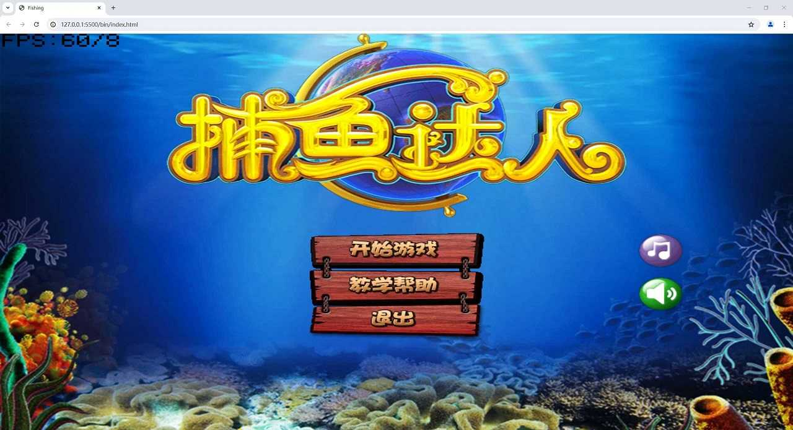
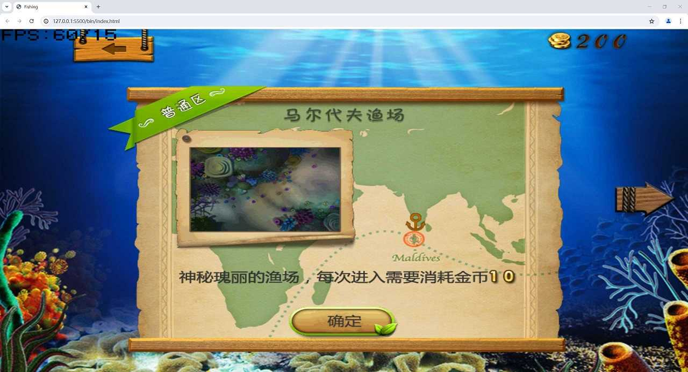
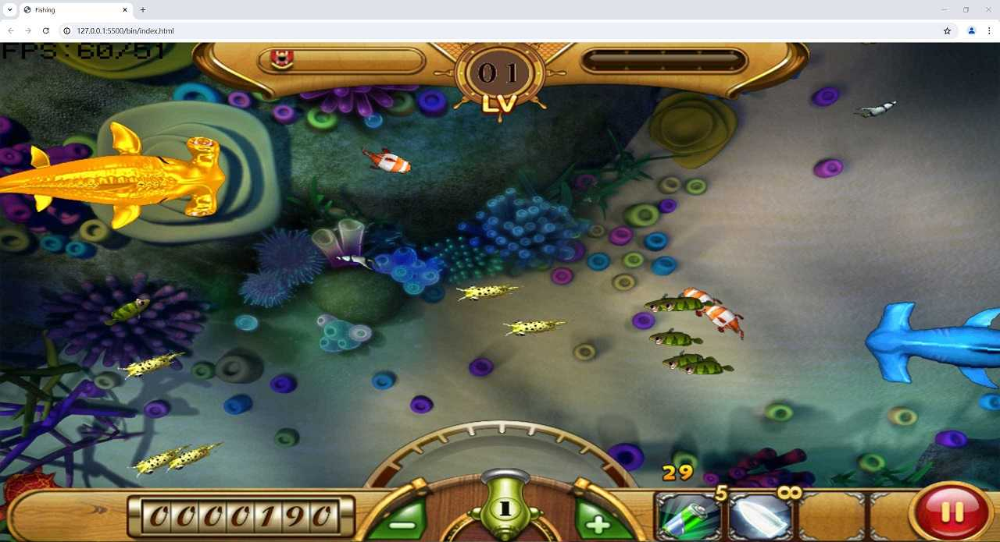

# ED_Fishing

使用 C++ 开发的网页版捕鱼达人

## 说明
开发此游戏的目的仅仅是为了学习C++，以及如何使用`SDL2`开发游戏，代码参考CSDN博主[小牛_牛sky](https://github.com/sky94520)。正是由于看到博主参考了`COCOS2D`对SDL2的封装，我决定将游戏移植到网页版，并解决了博主遗留遮罩的问题，新增了裁剪节点 `ClipNode`。

## 游戏

* 捕鱼达人：[https://naka1205.github.io/fishing/](https://naka1205.github.io/fishing/)
* 单机麻将：[https://naka1205.github.io/mahjong/](https://naka1205.github.io/mahjong/)

## 游戏界面




## 开发

技术栈： SDL2 + CMake + Vcpkg + MSVC + Ninja + Emscripten

### 安装开发环境与编译工具

1. 安装 VS2022 或者 MSVC 生成工具
2. 安装 CMake 3.29 或 更高版本
3. 安装 Vcpkg 
4. 安装 Ninja
5. 安装 Emscripten

* MSVC + CMake  编译发布桌面应用可执行程序
* Ninja + Emscripten 编译发布 `JAVASCRIPT` 与 `WebAssembly` 网页应用

### 安装依赖
```sh
vcpkg install sdl2:x64-windows-static
vcpkg install sdl2-gfx:x64-windows-static
vcpkg install sdl2-ttf:x64-windows-static
vcpkg install sdl2-image:x64-windows-static
vcpkg install sdl2_mixer:x64-windows-static
vcpkg install zlib:x64-windows-static
```

### 编译命令
```sh
// WEB
cmake -D CMAKE_TOOLCHAIN_FILE=D:/emsdk/upstream/emscripten/cmake/Modules/Platform/Emscripten.cmake -G "Ninja" -D CMAKE_BUILD_TYPE=Release -S "./" -B "./emscripten"
// EXE
cmake -D CMAKE_TOOLCHAIN_FILE=D:/vcpkg/scripts/buildsystems/vcpkg.cmake -G "Visual Studio 17 2022" -D CMAKE_BUILD_TYPE=Release -D VCPKG_TARGET_TRIPLET=x64-windows-static -D CMAKE_VERBOSE_MAKEFILE:BOOL=ON -S "./" -B "./build"
```

### 发布命令
```sh
// WEB
cd emscripten && emmake ninja
// EXE
cd build && cmake --build . --config Release
```


